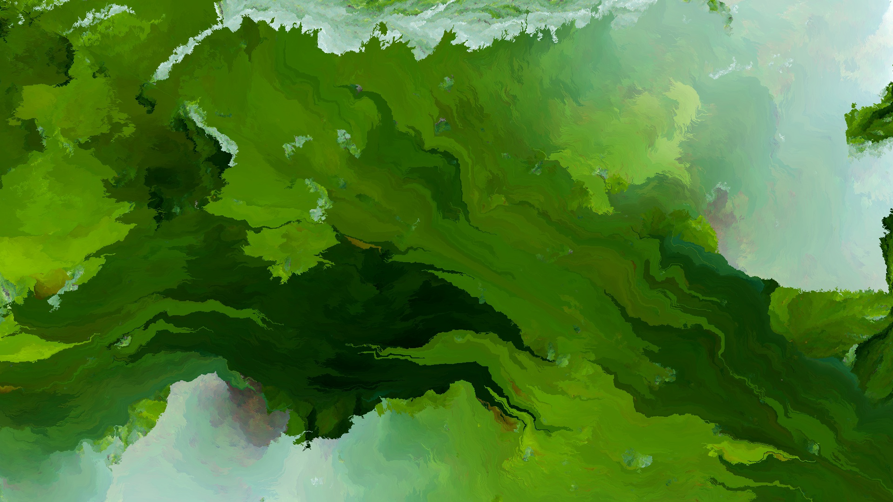

# ColourSorter
_ColourSorter takes a picture and rearranges the pixels to make another._

This Java application implements an algorithm to take all the pixels from an
image and use them to make a new image, based on a (sort of) sorting algorithm.
This was all inspired by József Fejes's
[all RGB sorting](http://joco.name/2014/03/02/all-rgb-colors-in-one-image/). This program implements his basic concept for pixel colour sorting, but uses images as the starting point, and add lots of options for sort order, distance metrics, and starting patterns. The combination of options as well as the sheer variety of possible starting material (i.e. any image or photograph) produces a huge variety of results.

## Usage
### Command line interface
ColourSorter is currently a command line app only. To run it fire up your favorite terminal or command prompt, then type ColourSorter along with the following required options

TODO list required arguments, and explain.

Beyond these basics ColourSorter provides many more command line options to vary the starting or internal parameters of the sorting algorithm.

TODO list optional arguments, and explain

### Python script
`runner.py` is a Python script to automate the running ColourSorter. It randomly select command line options, grabs images to sort from unsplash.com, and uses the multiprocessing module to run many instances of the (single threaded) ColourSorter at one time.

## Algorithm
TODO

## Examples

